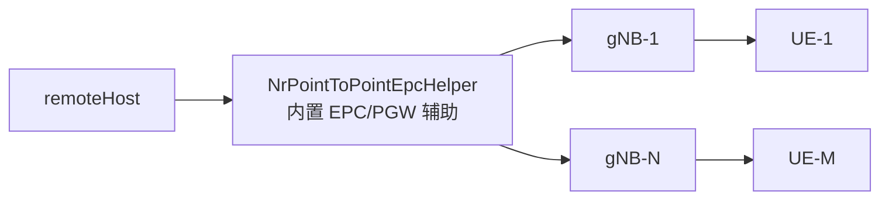
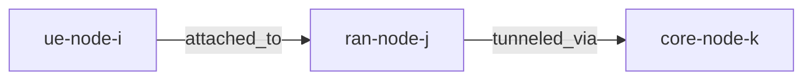
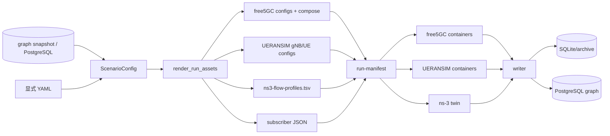

# QA

## 1. ns-3 脚本设计的网络拓扑图是怎么样的？对每个节点的属性设置的依据是什么？

先区分两个层面：

1. 实际在 ns-3 里参与仿真的拓扑
2. ns-3 每个 tick 导出的语义拓扑

### 1.1 实际仿真拓扑

当前 [sim/ns3/nr_multignb_multiupf.cc](sim/ns3/nr_multignb_multiupf.cc) 里真正创建的是一个 NR 无线接入拓扑，而不是一个把真实 free5GC 网元逐个搬进 ns-3 的拓扑。

几个关键点：

- gNB 和 UE 是真的 ns-3 节点，由 GridScenarioHelper 创建。
- remoteHost 也是实际存在的流量源节点，用来向 UE 发 UDP 下行流。
- “UPF”在当前 twin 里主要是语义概念，不是一个真实参与转发的 ns-3 Node；导出的 snapshot 里会出现 core-node-1、core-node-2 这类节点，但它们是根据场景里的 upfNames 和 gNB 到 UPF 映射补出来的语义节点。
- 因此这个 twin 更准确地说是“RAN 数字孪生 + 语义核心网抽象”，不是“把真实 free5GC 用户面逐跳搬到 ns-3 里”。

### 1.2 导出的语义拓扑

每个 tick 导出的 JSONL 快照里，拓扑长这样：

此外快照里还会带：

- gNbs 列表
- ues 列表
- flows 列表
- slices 列表
- kpis 和 reward_inputs

也就是说，导出的图强调的是：

- UE 挂在哪个 gNB 上
- gNB 逻辑上回程到哪个 UPF
- 每条业务流属于哪个 UE、哪个 slice、当前 KPI 是多少

### 1.3 各类节点属性的来源依据

#### gNB 节点

来源分两层：

- 配置层来源：场景 YAML 里的 gnbs，或者 graph_file / graph_snapshot 派生出的 ran_node
- 导出层来源：ns-3 snapshot 里只保留最核心的别名和关系

主要字段依据：

- name、alias、tac、nci、slices、backhaul_upf：来自场景配置，场景又可能来自显式 YAML，也可能由 graph_snapshot 合并生成
- 位置：优先来自 resolved topology 里的 gnb_positions；如果没有，就走 GridScenarioHelper 的默认网格布局
- snapshot 里的 attributes.alias：来自当前 gNB 的逻辑名字映射

#### UE 节点

主要字段依据：

- name、supi、key、op、op_type、amf、sessions：来自场景配置，场景也可以由 graph_snapshot 派生
- UE 挂载哪个 gNB：解析优先级是 free5gc_policy.target_gnb / preferred_gnbs > 图上的 attached_to > 显式 ue.gnb
- 位置：优先来自 resolved topology 里的 ue_positions；否则使用默认网格布局
- snapshot 里的 attributes.supi：来自 UE 的订阅标识

#### UPF 节点

主要字段依据：

- name、role、dnn：来自场景的 upfs，或 graph_snapshot 派生的 core_node
- gNB 到 UPF 的映射：来自 graph 中的 tunneled_via 边、显式 gnb.backhaul_upf，或者单 UPF 模式下的兜底推断
- snapshot 里的 attributes.role：固定导出为 upf

#### slice 和 flow 记录

- slice：来自场景 slices，或者 graph_snapshot 中的 slice 节点
- flow：来自场景 flows，或者 graph_snapshot 中的 flow 节点及其 service / traffic / sla / allocation 属性

### 1.4 当前 topology 设计的一个重要边界

当前 ns-3 twin 里：

- remoteHost 是真实节点，但没有导出到 snapshot
- UPF 是导出的语义节点，但不是独立仿真转发节点

所以如果问“这个图是不是实际每一跳都在 ns-3 里跑”，答案是：不是。它是“真实 RAN 仿真 + 逻辑核心语义映射”。

关键实现：

- [sim/ns3/nr_multignb_multiupf.cc](sim/ns3/nr_multignb_multiupf.cc)
- [bridge/common/topology.py](bridge/common/topology.py)
- [bridge/common/scenario.py](bridge/common/scenario.py)

## 2. ns-3 脚本在 RAN 侧的资源分配方案是什么？

当前实现不是一个“按 slice 或 SLA 做精细无线资源调度”的方案，而是一个“默认 NR 调度器 + 流量画像驱动负载 + dedicated bearer 分类”的方案。

### 2.1 已经明确配置的无线参数

脚本里固定设置了这些基础无线参数：

- 1 个 CC，1 个 BWP
- 4 GHz 中心频点
- 20 MHz 带宽
- numerology = 0
- gNB 天线 2x2
- UE 天线 1x1
- IdealBeamforming，方法是 DirectPathBeamforming
- 信道模型是 UMi / ThreeGpp
- 关闭 shadowing
- RLC UM 缓冲区上限被放大到很大，避免小缓冲造成明显的人为截断

### 2.2 流量和 bearer 的组织方式

每条 flow 的处理大致是：

1. remoteHost 侧创建一个 UdpClient
2. UE 侧创建一个对应端口的 UdpServer
3. 用目标端口创建 TFT 过滤器
4. 对该 UE 激活一个 dedicated EPS bearer

这里有两个非常重要的事实：

- 每条 flow 都会被单独分类到一个 dedicated bearer
- 但 bearer 类型当前固定写死为 NGBR_LOW_LAT_EMBB

也就是说：

- 端口级分类是有的
- 真正的无线资源调度策略并没有根据 5QI、slice 或 SLA 做差异化配置

### 2.3 当前“资源分配”真正受什么影响

当前 RAN 负载变化主要由 flow profile 驱动：

- packet_size_bytes
- arrival_rate_pps
- UE 挂在哪个 gNB
- gNB 数量和 UE 数量

这些参数会改变 offered load，从而间接改变：

- 吞吐
- 时延
- 抖动
- 丢包

但它并没有做到下面这些事情：

- 没有显式选择或改写 NR MAC scheduler
- 没有按 slice 预留 PRB
- 没有按 5QI 配置不同调度权重
- 没有把 latency / jitter / bandwidth 目标真正下压成无线侧调度约束

### 2.4 5QI 和 SLA 在 RAN 侧当前的角色

当前 5QI / SLA 主要用于：

- 从 graph snapshot 渲染 flow profile
- 在 snapshot 中把 service / sla / allocation 信息带出来
- 生成 free5GC subscriber payload 时补充 QoS 语义

它们目前不是 RAN 调度器的硬约束输入。

一句话概括：

当前 RAN 侧资源分配更接近“默认 NR 调度 + 业务负载驱动结果观测”，还不是“SLA 驱动的无线资源编排”。

关键实现：

- [sim/ns3/nr_multignb_multiupf.cc](sim/ns3/nr_multignb_multiupf.cc)
- [bridge/orchestrator/config_renderer.py](bridge/orchestrator/config_renderer.py)

## 3. ns-3 脚本如何接上的 UERANSIM 和 free5GC？仿真器的时间和实际时间不一致怎么解决？

### 3.1 当前是怎么“接上”的

当前接法是“统一场景 + 统一编排 + 统一观测”，不是“真实用户面数据包直接穿过 ns-3”。

整体链路如下：

核心点：

- free5GC 和 UERANSIM 是真实容器，真的发生注册、鉴权、PDU Session、NG Setup、PFCP 等控制面交互
- ns-3 twin 独立运行，读取同一个场景渲染出来的 flow profile 和 topology 映射
- writer 同时采集三路输出，把它们聚合成同一个 run_id 下的统一语义观测

### 3.2 当前不是哪种“接法”

当前不是下面这种强耦合：

- UERANSIM UE 的真实用户面流量进入 ns-3
- ns-3 再把用户面包转给真实 free5GC UPF
- free5GC / UERANSIM / ns-3 共享同一条实时 packet path

原因很直接：

- ns-3 twin 里用的是 NrPointToPointEpcHelper 自己的 EPC helper
- snapshot 里的 UPF 节点是语义映射，不是实际 ns-3 转发节点
- 仓库里虽然有 optional inline harness 脚本，但当前 twin 本身并没有消费 tap 设备
- 默认场景里 bridge.enable_inline_harness 也是 false

所以更准确的说法是：

当前是“真实核心网/终端容器 + ns-3 RAN 数字孪生 + 统一观测层”的混合式集成。

### 3.3 时间不一致现在怎么处理

当前实现采用“同 tick 窗口归桶”，不是严格实时时钟同步。

ns-3 侧：

- 自己维护 tick_index
- 直接把 Simulator::Now() 写成 sim_time_ms

free5GC / UERANSIM 侧：

- writer 跟日志时，会启动一个 ObservationClock
- 按 wall-clock 已经过了多少毫秒，除以 tick_ms 算出当前 tick_index

这意味着：

- ns-3 的时间是仿真时间
- free5GC / UERANSIM 的时间是实际时间
- 三者最终只是在 tick 粒度上对齐，而不是纳秒级或毫秒级严格同步

### 3.4 当前这种对齐方式的优缺点

优点：

- 足够支撑 smoke、日志关联、图快照写入和高层策略分析
- 工程上简单稳定

缺点：

- 不是严格实时 co-simulation
- 如果 ns-3 跑得比真实时间快或慢，tick 对齐会产生漂移
- 当前场景里的 ns3.simulator 字段虽然默认写的是 RealtimeSimulatorImpl，但运行脚本并没有把它真正下传并启用，所以它现在更像“声明”，不是“已生效机制”

一句话概括：

当前方案解决的是“统一时间桶里的可比观测”，还没有解决“仿真时间和真实时间严格一致”的问题。

关键实现：

- [bridge/orchestrator/process_plan.py](bridge/orchestrator/process_plan.py)
- [bridge/writer/cli.py](bridge/writer/cli.py)
- [bridge/writer/log_parser.py](bridge/writer/log_parser.py)
- [scripts/run_ns3_twin.sh](scripts/run_ns3_twin.sh)
- [sim/ns3/nr_multignb_multiupf.cc](sim/ns3/nr_multignb_multiupf.cc)

## 4. 有没有统一启动方案？默认从数据表解析网络配置

有，当前已经有统一启动方案，而且是脚本化的。

### 4.1 两种统一入口

#### 两段式入口

1. [scripts/render_run.py](scripts/render_run.py)
2. [scripts/start_stack.py](scripts/start_stack.py)

第一步负责 prepare-run：

- 加载场景
- 渲染配置
- 生成 run-manifest.json

第二步负责 start：

- 按 manifest 顺序执行 compose、subscriber bootstrap、writer、ns-3 build/run 等命令

#### 一键 smoke 入口

[scripts/run_graph_smoke.py](scripts/run_graph_smoke.py)

它把 prepare-run、启动、等待 writer 收敛、校验结果、compose-down 这些事情都包起来了。

### 4.2 当前统一启动顺序

run-manifest 里已经固化为：

1. compose-up-core
2. writer-follow-free5gc
3. bootstrap-subscribers
4. compose-up-ran
5. writer-follow-ueransim
6. writer-follow-ns3
7. ns3-build
8. ns3-run
9. compose-down

这已经是仓库里的标准编排顺序。

### 4.3 是否“默认从数据表解析网络配置”

当前代码支持三种来源：

1. 纯显式 YAML
2. topology.graph_file
3. topology.graph_snapshot_id + graph_db_url

其中：

- 只要场景里设置了 topology.graph_snapshot_id，就会在加载场景时先从 PostgreSQL 取 graph snapshot，再 merge 到场景对象里
- 如果没设置 graph_snapshot_id，就不会默认去数据库取

所以准确答案是：

- “支持从数据表解析，并且这条链路已经打通”是对的
- “所有场景默认都从数据表解析”目前不对

当前仓库更像“按场景选择数据源”。

如果团队要把“数据库快照优先”变成真正默认行为，可以把 graph_snapshot_id 写进标准场景模板，或者在 CLI 层增加默认 snapshot 选择逻辑；但这不是现在已经硬编码完成的行为。

关键实现：

- [bridge/common/scenario.py](bridge/common/scenario.py)
- [bridge/common/graph_adapter.py](bridge/common/graph_adapter.py)
- [bridge/orchestrator/cli.py](bridge/orchestrator/cli.py)
- [scripts/render_run.py](scripts/render_run.py)
- [scripts/start_stack.py](scripts/start_stack.py)
- [scripts/run_graph_smoke.py](scripts/run_graph_smoke.py)

## 5. 当前的整个仿真流程是什么样的？可作为真实 5G 网的交互模拟吗？

### 5.1 当前完整流程

1. 加载场景
2. 如果配置了 graph_snapshot_id，从 PostgreSQL 读取语义图快照并合并到场景
3. resolve topology，确定 UE 到 gNB、gNB 到 UPF、位置坐标等
4. 渲染 free5GC 配置、UERANSIM 配置、subscriber payload、ns-3 flow profile、compose 文件、manifest
5. 启动 free5GC core 容器
6. 通过 WebUI API 写入 subscriber
7. 启动 gNB 和 UE 容器
8. writer 后台跟随 free5GC 和 UERANSIM 日志
9. 编译并运行 ns-3 twin
10. writer 跟随 ns-3 的 tick-snapshots.jsonl
11. 把三路观测统一写入 SQLite、归档 JSON、可选 PostgreSQL 图数据库
12. smoke 脚本按 registration、PDU Session、TUN、NG Setup、PFCP、tick 数等指标校验是否通过

### 5.2 它现在“像什么”

它现在最准确的定位是：

- 一个 graph-driven 的 5G 集成编排器
- 一个真实 free5GC + UERANSIM 的 smoke/回归环境
- 一个 ns-3 驱动的 RAN 数字孪生和 KPI 生成器
- 一个统一语义观测与图快照写入管线

### 5.3 能不能当成“真实 5G 网交互模拟”

如果这里的“交互模拟”指的是控制面、观测面、配置面层面的联动验证，那么可以。

它已经能做：

- 真实 core 启动
- 真实 UE/gNB 注册和 PDU 建立
- graph snapshot 驱动的拓扑/切片/业务映射
- ns-3 KPI 输出
- 统一 run 下的事件与图快照落库

但如果这里的“真实 5G 网交互模拟”指的是：

- 真实 UE 用户面流量经过 ns-3 无线链路
- 再进入真实 free5GC 用户面
- 并且仿真时间与真实时间严格同步

那当前还不行。

### 5.4 结论

当前它是“混合式数字孪生 / smoke 平台”，不是“严格闭环的真实 5G 用户面联合仿真平台”。

可以用于：

- 架构验证
- 切片/业务建模验证
- 控制面打通验证
- KPI 与图快照驱动的策略研究

不应直接等同于：

- 全链路实时 packet-level 5G co-simulation

关键实现：

- [bridge/orchestrator/config_renderer.py](bridge/orchestrator/config_renderer.py)
- [bridge/orchestrator/process_plan.py](bridge/orchestrator/process_plan.py)
- [scripts/run_graph_smoke.py](scripts/run_graph_smoke.py)
- [bridge/writer/cli.py](bridge/writer/cli.py)

## 6. 对于 SLA 目标，在 ns-3 侧是怎么配置的？按理来说 SLA 存在于 UE 的订阅中，下游基础设施也就是 ns-3 在这里是如何感知并配置的？

### 6.1 当前仓库里的 SLA 真正落点在 flow，而不是 UE 订阅

这是当前实现里最重要的设计点之一。

在这个仓库里，SLA 不是让 ns-3 去动态读取 free5GC subscriber DB 才知道的；它是作为场景的显式 sideband 数据，直接进入 flow 模型。

也就是说，ns-3 当前感知 SLA 的方式不是：

- 先查 UE 订阅
- 再推导业务 SLA

而是：

- 场景里直接有 flows[].sla_target
- 或 graph snapshot 的 flow 节点里直接有 properties.sla

### 6.2 从数据库到 ns-3 的传播路径

如果走 graph_snapshot 路径，传播链路是：

1. graph snapshot 的 flow 节点里带 service / traffic / sla / allocation
2. [bridge/common/graph_adapter.py](bridge/common/graph_adapter.py) 把它们转成 ScenarioConfig.flows
3. [bridge/orchestrator/config_renderer.py](bridge/orchestrator/config_renderer.py) 把这些字段写进 ns3-flow-profiles.tsv
4. [sim/ns3/nr_multignb_multiupf.cc](sim/ns3/nr_multignb_multiupf.cc) 读取 TSV，装载为 FlowProfile

### 6.3 ns-3 侧实际用到了哪些 SLA 字段

当前 ns-3 twin 会读取并保留这些信息：

- five_qi
- latency_ms
- jitter_ms
- loss_rate
- bandwidth_dl_mbps
- bandwidth_ul_mbps
- guaranteed_bandwidth_dl_mbps
- guaranteed_bandwidth_ul_mbps
- priority
- allocated_bandwidth_dl_mbps
- allocated_bandwidth_ul_mbps
- optimize_requested

### 6.4 这些 SLA 字段当前真正起了什么作用

目前分成两类：

#### 真的影响仿真负载的字段

- packet_size_bytes
- arrival_rate_pps

这两项会直接改变流量强度和包大小，从而影响 KPI。

#### 主要用于语义记录的字段

- five_qi
- latency / jitter / loss_rate 目标
- bandwidth / guaranteed_bandwidth
- priority
- optimize_requested
- current_slice_snssai

这些字段会被写回 snapshot 的 flow.sla、flow.service、flow.allocation 等部分，用于后续观测、图落库、优化器输入。

### 6.5 这意味着什么

意味着当前 ns-3 对 SLA 的“感知”是：

- 配置渲染时离线注入
- 运行时按 FlowProfile 读取
- 输出时原样带回语义快照

而不是：

- 运行过程中从 free5GC/UERANSIM 的订阅状态动态下发给 RAN

一句话概括：

当前 ns-3 的 SLA 感知机制是“场景侧边带配置”，不是“核心网订阅驱动的在线闭环配置”。

关键实现：

- [bridge/common/graph_adapter.py](bridge/common/graph_adapter.py)
- [bridge/orchestrator/config_renderer.py](bridge/orchestrator/config_renderer.py)
- [sim/ns3/nr_multignb_multiupf.cc](sim/ns3/nr_multignb_multiupf.cc)

## 7. SLA 目标在 free5GC 和 UERANSIM 中是如何配置的？当前是从数据表中解析并设置吗？

这里要把“标准字段”和“本地扩展字段”分开看。

### 7.1 free5GC 当前真正收到的是什么

subscriber payload 里会构造很多内容，但真正 PUT 到 free5GC WebUI API 之前，会做一次 sanitize。

当前真正发给 free5GC 的主要是：

- AuthenticationSubscription
- AccessAndMobilitySubscriptionData
- SessionManagementSubscriptionData
- SmfSelectionSubscriptionData
- AmPolicyData
- SmPolicyData

其中与 QoS / SLA 最直接相关的是：

- SessionManagementSubscriptionData.dnnConfigurations[].5gQosProfile.5qi
- session 的 apn / slice / session_type

也就是说，free5GC 当前真正吃进去的是“session 级别的 5QI / slice / APN / type”。

### 7.2 哪些更丰富的 SLA 字段目前没有进 free5GC 运行时

subscriber JSON 里本地还会额外生成：

- LocalPolicyData
- FlowRules
- QosFlows
- ChargingDatas

这些里面其实已经有 flow 级 SLA，比如：

- latencyMs
- jitterMs
- bandwidthDlMbps
- guaranteedBandwidthDlMbps
- priority

但是这些字段在调用 WebUI API 前会被剔除掉，不会真正写入 free5GC 运行时的 subscriber 数据。

所以当前 free5GC 运行时并没有真正接收到完整 flow 级 SLA，只接收到了标准 subscriber 模型能表达的那部分，最核心是 5QI。

### 7.3 UERANSIM 当前收到的是什么

UERANSIM 的 uecfg.yaml 当前只会被渲染这些字段：

- SUPI / 鉴权信息
- gnbSearchList
- sessions
  - type
  - apn
  - slice.sst / slice.sd
- configured-nssai
- default-nssai

UERANSIM 当前不会消费这些字段：

- latency
- jitter
- bandwidth
- guaranteed bandwidth
- optimize_requested

也就是说，UERANSIM 侧当前也没有真正的 flow-level SLA 下发机制。

### 7.4 当前是不是从数据表解析并设置

如果场景走的是 graph_snapshot_id，那么答案是“部分是”。

更精确地说：

- graph snapshot 可以解析出 UE、slice、gNB、UPF、app、flow 和 flow.sla
- 这些信息会进入 ScenarioConfig
- 然后：
  - session / slice / APN / 5QI 会进一步渲染进 free5GC 和 UERANSIM 配置
  - 更完整的 flow-level SLA 目前主要渲染进 ns-3 flow profile 和本地 subscriber JSON sidecar
  - 但不会真正下发进 free5GC WebUI 标准接口，也不会被 UERANSIM 直接消费

### 7.5 结论

当前 free5GC / UERANSIM 对 SLA 的支持分层如下：

- 已生效：slice、APN、session_type、5QI
- 已生成但仅本地保留：flow-level SLA / LocalPolicyData / FlowRules / QosFlows
- 未形成在线闭环：free5GC 把这些 richer policy 再下发给 UERANSIM 或 RAN

一句话概括：

当前“从数据表解析并设置”是成立的，但只对一部分标准字段真正生效；完整 SLA 目前主要在 ns-3 和本地语义层生效，还没有完整进入 free5GC / UERANSIM 运行时闭环。

关键实现：

- [adapters/free5gc_ueransim/subscriber_bootstrap.py](adapters/free5gc_ueransim/subscriber_bootstrap.py)
- [bridge/common/graph_adapter.py](bridge/common/graph_adapter.py)
- [bridge/common/scenario.py](bridge/common/scenario.py)
- [bridge/orchestrator/config_renderer.py](bridge/orchestrator/config_renderer.py)

## 总结

如果只用一句话总结当前仓库状态：

当前系统已经实现了“数据库图快照驱动的场景解析 + 真实 free5GC/UERANSIM 控制面 smoke + ns-3 RAN 数字孪生 + 统一语义写库”，但还没有实现“严格实时时间同步的、真实用户面闭环的 5G 联合仿真”。