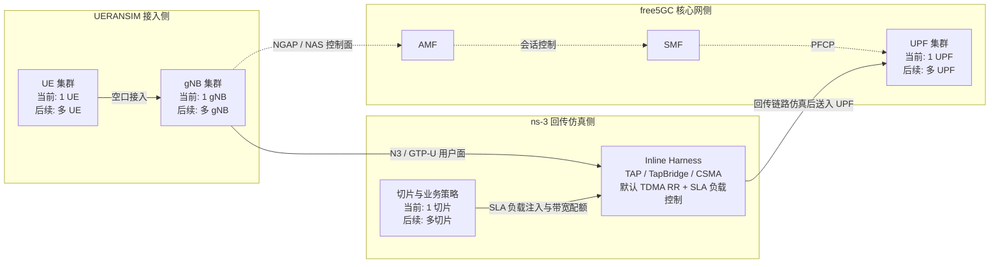

# 周报：free5GC + UERANSIM + ns-3 在 1UE 1gNB 1UPF 场景下的联通梳理

日期：2026-04-19

## 一、本周工作主题

本周围绕 1UE、1gNB、1UPF 最小场景，对项目中 free5GC、UERANSIM、ns-3 的联通方式进行了梳理，并按 ns-3 作为内联网桥的口径整理为一份可复用说明。

本文采用的场景基线是 [scenarios/baseline_single_upf_inline_smoke.yaml](scenarios/baseline_single_upf_inline_smoke.yaml)。该场景明确开启了 inline harness，适合说明 ns-3 作为 gNB 与 UPF 之间内联网桥时的整体流程。

## 二、本周结论

1. free5GC 负责真实核心网控制面与用户面锚点，UERANSIM 负责真实的 gNB 和 UE 容器，ns-3 按 inline harness 方案插在 gNB 与 UPF 之间，承担回传链路仿真与链路特性注入。
2. 控制面没有走 ns-3，而是仍然运行在 Docker Compose 的 privnet 网络中。也就是说，UE 注册、PDU 会话建立、SMF 到 UPF 的 PFCP 等流程依旧由 free5GC 和 UERANSIM 直接完成。
3. 用户面按桥接方案被重定向到 ns-3 所挂载的 TAP 设备，再通过 ns-3 内部的 TapBridge 和 CSMA 链路完成转发，从而把 gNB 到 UPF 的 N3 段放进仿真链路里。
4. writer 同时采集 free5GC 日志、UERANSIM 日志和 ns-3 的 JSONL 快照，最终把三路观测结果统一到同一个 run_id 下。

## 三、本周完成情况

### 1. 场景范围确认

已确认最小场景包含以下实体：

- 1 个切片：SST=1，SD=010203，标签 embb
- 1 个 UPF：upf，DNN 为 internet
- 1 个 gNB：gnb1，别名 gnb.free5gc.org
- 1 个 UE：ue1，SUPI 为 imsi-208930000000001
- 1 条默认业务会话：IPv4，APN 为 internet，5QI=9

对应场景文件见 [scenarios/baseline_single_upf_inline_smoke.yaml](scenarios/baseline_single_upf_inline_smoke.yaml)。

### 2. 编排链路确认

运行编排由 [bridge/orchestrator/process_plan.py](bridge/orchestrator/process_plan.py) 和 [bridge/orchestrator/config_renderer.py](bridge/orchestrator/config_renderer.py) 生成，inline harness 形态下的主要步骤如下：

1. 启动 free5GC 核心网容器
2. 后台跟踪 free5GC 日志
3. 通过 WebUI API 自动注册 UE 订阅数据
4. 启动 UERANSIM 的 gNB 和 UE 容器
5. 执行 bridge-setup，把 gNB 与 UPF 两侧接口接入主机网桥与 TAP 设备
6. 后台跟踪 UERANSIM 日志
7. 后台跟踪 ns-3 输出的 JSONL 快照
8. 编译并运行 ns-3

这一顺序也在 [tests/test_renderer.py](tests/test_renderer.py) 里有针对 inline bridge 的校验。

## 四、1UE 1gNB 1UPF 联通流程说明

### 1. 配置渲染阶段

场景文件首先由渲染器转换为一组运行产物，主要包括：

- free5GC 核心网配置，如 AMF、NSSF、SMF、UPF 的 YAML
- gNB 配置文件和 UE 配置文件
- 渲染后的 Docker Compose 文件
- UE 订阅者 JSON
- ns-3 的流画像文件
- inline bridge 脚本
- run-manifest.json 启动清单

关键实现位于 [bridge/orchestrator/config_renderer.py](bridge/orchestrator/config_renderer.py)。

在 1UE 1gNB 1UPF 场景下，渲染后的关键地址关系如下：

- AMF 控制面地址：10.100.200.16
- SMF 控制面地址：10.100.200.110
- UPF 地址：10.100.200.15
- gNB1 地址：10.100.200.101

其中：

- gNB 配置由 [_render_gnb_configs](bridge/orchestrator/config_renderer.py) 生成，给 gNB1 设置 NGAP、GTP 和链路地址
- UE 配置由 [_render_ue_configs](bridge/orchestrator/config_renderer.py) 生成，给 ue1 设置 SUPI、鉴权参数、gNB 搜索列表和 PDU Session
- Compose 叠加由 [adapters/free5gc_ueransim/compose_override.py](adapters/free5gc_ueransim/compose_override.py) 生成，把 gNB、UE 动态挂到 free5GC Compose 体系里

### 2. 订阅者导入阶段

在核心网启动后，项目通过 [adapters/free5gc_ueransim/subscriber_bootstrap.py](adapters/free5gc_ueransim/subscriber_bootstrap.py) 自动向 free5GC WebUI 写入订阅者数据。

导入方式是 HTTP PUT，请求路径为：

- /api/subscriber/{ueId}/{plmnId}

导入内容包括：

- UE 的 AKA 鉴权参数
- 默认 SQN 和 AMF 字段
- 切片信息 S-NSSAI
- DNN 或 APN 信息
- QoS 与会话类型配置

这样做的意义是：UERANSIM UE 在后续发起注册时，free5GC 已经具备对应的用户数据与会话策略，不需要人工提前往 WebUI 录入。

### 3. 控制面联通阶段

控制面链路的实际参与者是 UE、gNB、AMF、SMF、UPF，ns-3 不承载控制面协议，只负责桥接用户面相关的内联网段。

控制面流程可以概括为：

1. UE 容器启动后，读取渲染好的 uecfg，搜索 gNB1
2. gNB1 根据渲染后的 gnbcfg，向 AMF 建立 NGAP 连接
3. UE 通过 gNB 向 AMF 发起注册与鉴权流程
4. AMF、SMF 根据订阅数据为 UE 建立 PDU Session
5. SMF 通过 PFCP 与 UPF 建立用户面规则

这条链路里使用的关键技术有：

- UERANSIM 的 nr-ue 和 nr-gnb 进程
- free5GC 的 AMF、SMF、UPF、NSSF、NRF 等核心网服务
- NGAP 和 NAS 完成接入与注册控制
- PFCP 完成 SMF 到 UPF 的规则下发
- Docker Compose privnet 作为容器间控制面互联网络

### 4. 用户面联通阶段

本文的重点是按 ns-3 内联网桥口径说明 gNB 到 UPF 的 N3 段。

在 inline harness 场景下，bridge 脚本由 [adapters/free5gc_ueransim/bridge_setup.py](adapters/free5gc_ueransim/bridge_setup.py) 生成。该脚本完成以下动作：

1. 通过 docker inspect 获取 gNB 容器和 UPF 容器的进程 PID
2. 在主机上创建一对 TAP 设备：tgnb1 和 tupf1
3. 在主机上创建两座 Linux Bridge：brg1 和 bru1
4. 将 tgnb1 挂到 brg1，将 tupf1 挂到 bru1
5. 为 gNB 侧和 UPF 侧分别创建 veth 对
6. 把 veth 的一端放入对应容器命名空间，重命名为 esg1 和 esu1
7. 给 esg1 和 esu1 分配 10.210.1.1/30 和 10.210.1.2/30 地址
8. 在 gNB 容器里添加到 10.100.200.15 的主机路由，使其经 esg1 出口
9. 在 UPF 容器里添加到 10.100.200.101 的主机路由，使其经 esu1 返回

这意味着 gNB 与 UPF 间的指定流量不再直接走 Compose 默认路径，而是被导向这组新建的桥接接口。

### 5. ns-3 作为内联网桥的阶段

ns-3 程序由 [scripts/build_ns3_twin.sh](scripts/build_ns3_twin.sh) 和 [scripts/run_ns3_twin.sh](scripts/run_ns3_twin.sh) 调起，主体逻辑位于 [sim/ns3/nr_multignb_multiupf.cc](sim/ns3/nr_multignb_multiupf.cc)。

在 inline harness 模式下，启动参数会额外带上：

- --bridge-gnb-taps=tgnb1
- --bridge-upf-taps=tupf1
- --bridge-link-rate-mbps=250.0
- --bridge-link-delay-ms=2.0

ns-3 收到这些参数后，会执行以下工作：

1. 解析 bridgeGnbTaps 和 bridgeUpfTaps
2. 为每个 gNB-UPF 对创建一段独立的 CSMA 链路
3. 使用 TapBridge，模式为 UseBridge，把主机上的 TAP 设备挂到 ns-3 的设备上
4. 用 bridgeLinkRateMbps 和 bridgeLinkDelayMs 给这段链路注入带宽和时延属性

在 1UE 1gNB 1UPF 下，这条用户面路径可以按下面理解：

1. UE1 通过 UERANSIM 接入 gNB1
2. gNB1 发往 UPF 的 N3 流量被路由到 esg1
3. esg1 进入 brg1，再进入 tgnb1
4. tgnb1 通过 TapBridge 接入 ns-3
5. ns-3 在内部用一段 CSMA 链路模拟 gNB 到 UPF 的回传网络
6. 链路另一端再经 tupf1、bru1、esu1 回到 UPF 容器
7. UPF 继续完成用户面处理

因此，按本周采用的架构口径，ns-3 位于 gNB 和 UPF 之间，承担了内联网桥和回传链路仿真的角色。

### 6. writer 统一观测阶段

三模块联通后，writer 负责汇总运行结果：

- [bridge/writer/cli.py](bridge/writer/cli.py) 跟踪 free5GC 和 UERANSIM 的 Compose 日志
- [bridge/writer/log_parser.py](bridge/writer/log_parser.py) 把关键日志解析成 SimEvent
- [bridge/writer/cli.py](bridge/writer/cli.py) 同时跟踪 ns-3 输出的 JSONL 快照
- [bridge/writer/local_store.py](bridge/writer/local_store.py) 将数据写入 SQLite 和归档目录
- [bridge/writer/postgres_graph_store.py](bridge/writer/postgres_graph_store.py) 可选地把图快照写入 PostgreSQL

统一观测后的好处是：

- 可以同时看到 UE 注册、PDU Session 建立、TUN 建链、ns-3 链路指标变化
- 可以把控制面事件和用户面链路快照挂到同一个 run_id 下分析
- 可以为后续策略控制、图分析和多智能体决策提供统一输入

## 五、三模块如何联通

### 1. free5GC 与 UERANSIM 如何联通

- 通过渲染后的 Compose 文件挂在同一 Docker 网络中
- gNB 使用渲染后的 AMF 地址与 free5GC 建立 NGAP 连接
- UE 使用渲染后的 gNB 搜索列表接入 gNB
- 订阅者数据提前通过 WebUI API 导入 free5GC

### 2. UERANSIM 与 ns-3 如何联通

- 通过 Linux TAP 设备联通
- 通过 Linux Bridge 和 veth 把 TAP 接口引入 gNB 侧路径
- 通过 TapBridge 把主机 TAP 映射为 ns-3 设备

### 3. free5GC 与 ns-3 如何联通

- 通过 UPF 侧的 veth、Linux Bridge、TAP 设备接入 ns-3
- 通过容器路由把 gNB-UPF 指定流量导向这条桥接链路
- 通过 writer 把 free5GC 日志和 ns-3 快照汇总到同一观测面
- 当前 RAN 侧使用默认的 TDMA RR 调度器，并在业务层叠加按 SLA 计算的流量注入与带宽配额控制

## 六、使用的关键技术

| 技术 | 所属模块 | 作用 |
| --- | --- | --- |
| Docker Compose | free5GC + UERANSIM | 启动核心网、gNB、UE 容器并维护私网互联 |
| YAML 配置渲染 | 编排层 | 把场景声明转换为 gNB、UE、SMF、UPF 配置 |
| free5GC WebUI API | free5GC | 自动导入 UE 订阅者数据 |
| UERANSIM nr-ue / nr-gnb | UERANSIM | 生成真实 UE 与 gNB 行为 |
| NGAP / NAS | free5GC + UERANSIM | 完成接入、注册、会话控制 |
| PFCP | SMF + UPF | 下发用户面规则 |
| GTP-U | gNB + UPF | 承载用户面隧道流量 |
| Linux Bridge | 主机桥接层 | 把容器侧 veth 与 TAP 设备拼接起来 |
| veth pair | 主机桥接层 | 把主机网络与容器命名空间连接起来 |
| nsenter | 主机桥接层 | 向容器网络命名空间注入接口与路由 |
| TAP 设备 | 主机桥接层 + ns-3 | 让真实网络接口与 ns-3 设备绑定 |
| TapBridge | ns-3 | 把主机 TAP 接入 ns-3 仿真链路 |
| CSMA | ns-3 | 模拟 gNB 到 UPF 之间的回传链路 |
| JSONL TickSnapshot | ns-3 + writer | 输出链路快照与性能指标 |
| SQLite / PostgreSQL | writer | 持久化语义事件、图快照与指标 |

### 模块联通流程图

下图只展示 free5GC、UERANSIM、ns-3 三个模块之间的核心联通逻辑，并保留后续扩展到多 UE、多 gNB、多切片的表达方式。

## 七、当前说明口径下的整体链路

控制面：

- UE1 -> gNB1 -> AMF
- AMF -> SMF
- SMF -> UPF

用户面：

- UE1 -> gNB1 -> esg1 -> brg1 -> tgnb1 -> ns-3 -> tupf1 -> bru1 -> esu1 -> UPF

观测面：

- free5GC 日志 -> writer
- UERANSIM 日志 -> writer
- ns-3 TickSnapshot -> writer

## 八、存在的问题与建议

1. 当前周报按 inline harness 架构说明了 ns-3 作为内联网桥的接法，适合用于项目方案汇报和架构说明。
2. 如果后续要把这份说明升级为实验报告，建议再补一组实测结果，包括注册成功日志、PDU 建立日志、bridge-setup 执行结果和 ns-3 输出指标。
3. 如果后续要面向答辩或论文场景使用，建议再补一张拓扑图，把 Docker privnet 控制面和 ns-3 桥接用户面分层画清楚。
