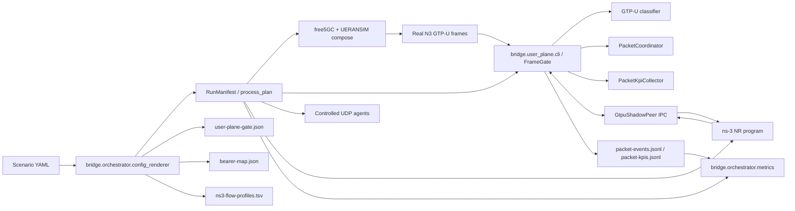
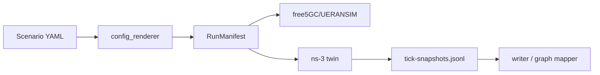

# GTP-U-Aware NR User Plane Architecture

This document describes the coupling architecture of the `codex/gtpu-aware-nr-user-plane` branch and compares it with the repository mainline (`master` in this checkout).

## Branch-Level Coupling

The branch keeps the original scenario-driven free5GC/UERANSIM/ns-3 renderer, but inserts a packet-level user-plane control layer between the real N3 endpoints and ns-3. Control-plane setup remains wall-clock based. Experiment user-plane packets are gated by ns-3 virtual-time outcomes.

## Module Responsibilities

### `bridge.common.scenario`

Owns the declarative contract. This branch extends the contract with:

- `flow.rlc_mode`
- `flow.virtual_expiry_ms`
- GTP-U mapping fields such as `ue_ip`, `qfi`, `inner_protocol`, `ue_port`, and `remote_port`
- ns-3 reproducibility fields such as `rng_run`, `virtual_epoch_us`, `channel_update_ms`, and `shadowing_enabled`
- `bridge.user_plane_gate` limits and fail-closed policy

Coupling direction: scenario data flows downward into rendering and runtime assets. Runtime code does not mutate scenario state.

### `bridge.orchestrator.config_renderer`

Renders all run-time artifacts from the scenario:

- traditional free5GC/UERANSIM configs
- `ns3-flow-profiles.tsv`
- `slice-resources.tsv`
- `user-plane-gate.json`
- `bearer-map.json`

Coupling direction: renderer consumes scenario/topology and emits immutable files. The gate and ns-3 consume those files rather than calling renderer code.

### `bridge.orchestrator.process_plan`

Builds the execution manifest. In this branch it additionally wires:

- `user-plane-gate` after bridge setup
- controlled real UE flow generation
- gated ns-3 arguments: socket, bearer map, seed/run, virtual epoch, channel update, shadowing
- `validate-gated-metrics` after `ns3-run` and before cleanup

Coupling direction: the manifest coordinates process order, but it does not own packet state.

### `bridge.user_plane.protocol`

Defines the versioned IPC frame format shared by the Python gate and ns-3 peer:

- binary header: magic, version, type, flags, payload length, sequence
- deterministic JSON payloads
- incremental stream decoder

Coupling direction: gate, controlled agents, and ns-3 peer depend on this protocol contract. Packet lifecycle logic is outside the protocol module.

### `bridge.user_plane.gtpu`

Pure parser/classifier for real Ethernet/IP/UDP/GTP-U frames. It extracts:

- TEID
- QFI
- outer gNB/UPF endpoint role
- inner UE IP and UDP tuple

It returns typed decisions: control bypass, managed packet, unmapped, or malformed.

Coupling direction: `FrameGate` depends on classifier decisions. The parser has no dependency on sockets, ns-3, or orchestration.

### `bridge.user_plane.coordinator`

Owns packet and epoch state:

- packet IDs
- pending byte/packet capacity
- captured/submitted/delivered/dropped/released/discarded transitions
- virtual expiry
- fail-closed disconnect handling

Coupling direction: `FrameGate` calls coordinator methods; coordinator returns release/drop actions without knowing about TAPs, GTP-U parsing, or ns-3 internals.

### `bridge.user_plane.gate` and `frame_port`

`FrameGate` binds classifier, coordinator, KPI collector, frame ports, and peer IPC into one testable runtime. `frame_port` isolates privileged Linux packet I/O behind an interface, so unit tests can use in-memory ports.

Coupling direction: this is the integration boundary for real frames. It holds original GTP-U bytes locally and sends only metadata to ns-3.

The runtime buffers current-epoch authorizations until a controlled agent connects. Authorization IDs are idempotent in both the relay and the production Docker sender, so a reconnect cannot create duplicate application packets. Output JSONL files are truncated at run start to prevent stale records from contaminating a repeated run.

### `bridge.user_plane.routing`

The endpoint router models N3 as an explicit bipartite graph. Each unique gNB or UPF owns one TAP even when it participates in several links. IPv4 and ARP targets select a neighboring endpoint directly; learned unicast MACs are constrained to the same adjacency set; unknown control destinations flood only to configured neighbors. A known endpoint without a declared N3 edge is rejected instead of crossing topology boundaries.

Scenario topology preserves all `tunneled_via` graph edges in `gnb_to_upfs`. Required `backhaul_upfs` declares edges directly. Optional per-flow `upf_ref` is validated against the UE's target gNB and is retained in ns-3 snapshots.

### `bridge.user_plane.kpi`

Derives packet delay, IPDV, throughput, delivered bytes, and drops only from virtual-time packet events. It does not infer drops from SLA thresholds or fabricate replacement samples for warm-up packets.

Coupling direction: the gate records events; `bridge.orchestrator.metrics` later validates emitted logs.

### `bridge.orchestrator.metrics`

Validates `packet-events.jsonl` and `packet-kpis.jsonl` after a gated run:

- every packet is terminal
- terminal timestamps do not precede enqueue timestamps
- delivered/dropped counts conserve submitted packets
- KPI rows match packet events
- invalid runs fail instead of being silently repaired

Coupling direction: this module is post-run validation. It does not feed back into packet scheduling.

### `bridge.user_plane.udp_agent` and `scripts/run_real_ue_flows.py`

Controlled UDP generation prevents wall-clock producers from outrunning virtual time. An agent sends one datagram per `AUTHORIZE_SEND` message. The former free-running path was removed because it bypassed ns-3 packet authorization.

Coupling direction: agents depend on the protocol and rendered flow plan, not on gate internals.

The production sender waits for the requested UE tunnel and downlink route instead of silently losing an authorization during startup. This turns an implicit epoch deadlock into an observable readiness wait, while the ns-3 peer has a host-side liveness timeout that fails an invalid run.

### `sim/ns3/gtpu_shadow_peer.h` and `sim/ns3/nr_multignb_multiupf.cc`

The ns-3 peer connects to the gate over Unix-domain socket IPC:

- receives `PACKET_ENQUEUE`
- injects a tagged shadow UDP packet into the configured NR bearer
- emits `PACKET_DELIVER`, `PACKET_DROP`, `TICK_COMPLETE`, and `AUTHORIZE_SEND`
- uses `Simulator::Now()` for packet outcomes and epoch timestamps

`nr_multignb_multiupf.cc` consumes the rendered bearer map in gated mode and applies flow-specific `5QI`, `QFI`, `RLC` mode, and virtual expiry overrides. The shadow packet tag retains packet ID, epoch ID, flow ID, QFI, and virtual enqueue time. 5G-LENA uses its `PacketErrorRateBased` bearer-to-RLC mapping; scenario validation rejects a requested UM/AM mode that conflicts with the selected standardized 5QI. FlowMonitor remains a cross-check path, while gated packet KPIs come from packet events.

The Unix peer uses non-blocking socket operations. Duplicate packet IDs, unknown flows, invalid directions/QFIs, oversized protocol frames, virtual-time mismatches, and missing controlled packets terminate the run instead of corrupting epoch accounting.

Coupling direction: ns-3 owns radio modeling and virtual time. The gate owns original real frames. They exchange metadata only.

### `scripts/build_ns3_program.py`

Prepares ns-3 scratch sources:

- copies `nr_multignb_multiupf.cc`
- copies `gtpu_shadow_peer.h`
- compiles `gtpu_shadow_peer.cc`
- copies `gtpu_shadow_peer_test.cc`
- can run `./ns3 build` on a Linux/ns-3 host

Coupling direction: this is a deployment helper. It does not affect runtime behavior.

## Runtime Data Flow

1. Scenario YAML is loaded and validated.
2. Renderer emits compose/config files, flow TSV, gate JSON, and bearer-map JSON.
3. Manifest starts free5GC/UERANSIM and waits for real control-plane sessions.
4. Bridge setup redirects N3 interfaces into TAPs.
5. `FrameGate` captures real GTP-U frames.
6. Classifier maps G-PDUs to configured flows.
7. Coordinator records pending packets and sends metadata to ns-3.
8. ns-3 injects one shadow packet for each real packet and returns delivery/drop by virtual time.
9. Gate releases or discards the original frame exactly once.
10. Packet events and epoch KPIs are written.
11. Metrics validator checks conservation and timestamp invariants before cleanup.

## Fast Episode Reset

`bridge.orchestrator.fast_reset` owns every long-running process in a generation. A reset stops that generation, removes only run-owned active artifacts, restarts existing free5GC/UERANSIM containers, reapplies idempotent baseline data and TAP setup, then launches a fresh ns-3 process from simulation time zero. It preserves generated configuration, images, the Compose network, and the ns-3 build, which keeps the repeated path short. Standard and split-mode manifests share this lifecycle; split runtime/result files and PFCP readiness are included.

The reset API is serialized and persists its generation/PID registry atomically. It validates process identity before killing a recovered PID and requires bearer authentication outside loopback. Its successful response is process-level readiness; UE registration and PDU-session convergence continue asynchronously behind fail-closed traffic admission.

## Comparison With Mainline (`master`)

Mainline has a simpler orchestration shape:

The mainline modules are effective for scenario rendering, compose orchestration, log parsing, graph mapping, and FlowMonitor-style snapshot ingestion. However, real N3 user-plane traffic is not causally gated by packet-level NR outcomes. Inline harness behavior is mostly a bridge/tap path plus external traffic state merging.

This branch adds an explicit user-plane control plane:

| Area | Mainline architecture | GTP-U-aware branch |
| --- | --- | --- |
| Real GTP-U packet handling | Transparent or externally observed | Captured, classified, retained, released/dropped by ns-3 result |
| Timing model | ns-3 snapshots plus wall-clock real flow state | ns-3 virtual time is authoritative for controlled user-plane packets |
| Metrics | Tick snapshots and merged real traffic state | Packet events plus validated per-epoch KPIs |
| Failure behavior | Legacy paths can continue if external state is missing | Fail-closed for unmapped packets, peer loss, capacity overflow, invalid metrics |
| Coupling style | Orchestrator and writer are central integration points | Packet concerns isolated into `bridge.user_plane` modules with clear interfaces |
| Testability | Renderer/writer/log parser unit tests | Adds protocol, parser, coordinator, gate, KPI, controlled agent, and loopback tests |

## Advantages

1. Stronger causal fidelity: original real GTP-U bytes are not forwarded until the corresponding NR shadow packet is delivered.
2. Better fault isolation: parsing, lifecycle, IPC, frame I/O, KPI aggregation, and orchestration are separate modules.
3. Stronger reproducibility: seed/run, epoch duration, channel update, and shadowing are rendered and passed explicitly.
4. Safer failure semantics: unknown mappings, malformed G-PDUs, disconnected peers, authorization loss, and metric invariant violations fail closed or invalidate the run explicitly.
5. Cleaner testing surface: Linux privileged I/O is behind `FramePort`, so packet lifecycle and KPI logic are testable on Windows.
6. More defensible metrics: delay, IPDV, loss, and throughput come from observed packet events and are validated after the run.
7. Single production path: real UE traffic is always gate-authorized; FlowMonitor snapshots remain only as a metric cross-check.

## Verification Status and Boundary

The Python suite and deterministic loopback validate protocol, parser, lifecycle, KPI, manifest wiring, multi-link endpoint routing, and log invariants. The branch has also been built against ns-3.46.1/5G-LENA under WSL: the fragmented native peer test passes; a native gated main-program smoke completes an epoch with terminal results for every submitted packet; a 2-gNB/2-UPF smoke verifies per-flow UPF selection; repeated fixed seed/run simulations produce identical snapshots; and changing `rngRun` changes the result.

The remaining environment boundary is the fully privileged online composition of Docker free5GC, UERANSIM, TAP interfaces, and real N3 traffic. That path requires the configured Linux deployment and `CAP_NET_ADMIN`; it is not simulated by the deterministic peer test.

## Known Constraints

- All N3 endpoints currently share one Docker IPv4 network and one transparent ns-3 CSMA segment. Link rate, delay, and loss are global bridge parameters rather than per-edge values.
- The fully privileged multi-endpoint Docker/TAP deployment still requires validation on the target Linux experiment host; native ns-3 and in-memory multi-link forwarding are covered here.
- Tagged `NrRlc::TxDrop` and `NrNetDevice::Drop` events are exported with explicit reasons. Wireless losses that cannot retain packet-level identity terminate through virtual expiry.
- `PacketErrorRateBased` is the 5G-LENA mechanism available for per-bearer UM/AM selection, so 5QI and requested RLC mode must be compatible.
- The gate deliberately retains original frames in bounded host memory; sizing must account for the largest expected bandwidth-delay product.
- Fast reset preserves the persistent free5GC subscriber database and reapplies the rendered baseline with idempotent upserts; it resets runtime NF associations by restarting the NFs rather than recreating MongoDB volumes.
- External graph-database history is not deleted by episode reset. Run-owned SQLite, snapshots, packet logs, split state, and local archives are reset.
